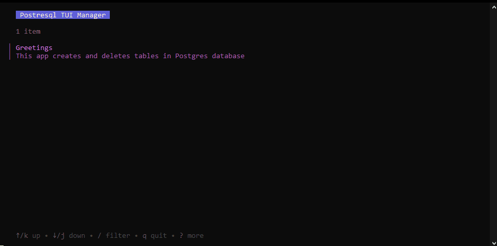

<p align="center" style="font-size: 32px; bold">TUI Application for Database Management</p>

---

<p align="center" style="font-size: 28px; bold">🚧🛠️ Project is under development! 🛠️🚧</p>





**DBubble** is a lightweight and minimalistic TUI written in Go for database management. It allows users to view, add and delete entries through an intuitive terminal interface without knowlege of SQL.


## ✨ Implemented Features

- 📜 View record list

- ➕ Add static records

- ❌ Delete last records
  
- ✏️ Create static table

- 🧭 Page routing for Bubble Tea framework

## Depedencies

- Database: [PostgreSQL](https://www.postgresql.org/)
- TUI Framework: [Bubble Tea](https://github.com/charmbracelet/bubbletea)
- Styling: [Lipgloss](https://github.com/charmbracelet/lipgloss)
- ORM: [GORM](https://github.com/go-gorm/gorm)

## Installation
1. Clone the repository:
```
git clone https://github.com/anfmx/DBubble.git
cd DBubble
```
2. Install dependencies:
```
go mod tidy
```
3. Run the application:
```
go run main.go
```
Or build it and run
```
go build
```
## ⚡ Configuration

**When you first start or there is no .config file**, the application will prompt you to enter the name, password and port from the postgres server and will create a .config file.  
You can also specify all the connection information in the .config file

## 🎮 Usage
* ⬆️⬇️ Navigate records using arrow keys
  
* 🚪 Exit: **Q** or **Ctrl+C**
  
* 🧭 Select option: **Enter**
  
* 🔍 Options filter: **/**
  
* ⏮️ Return to the first option: **g** or **Home**
  
* ⏭️ Return to the last option: **G** or **End**

## 🎯 TODO Plan
* 🔄 Implement table selection (choose which table to work with)

* 📝 Allow insertion of custom values

* 🏗️ Add functionality to create new columns

* 🗑️ Enable deletion of records

* ⚙️ Improve configuration options

* 🎨 Enhance TUI design and usability
  
* 🔒 Encryption of data required to connect to the database

## License
This project is licensed under the [MIT License](https://opensource.org/license/mit).

You are free to use, modify, and distribute this project, provided that you include a copy of the license in your project.

For more details, please refer to the LICENSE file in the repository.